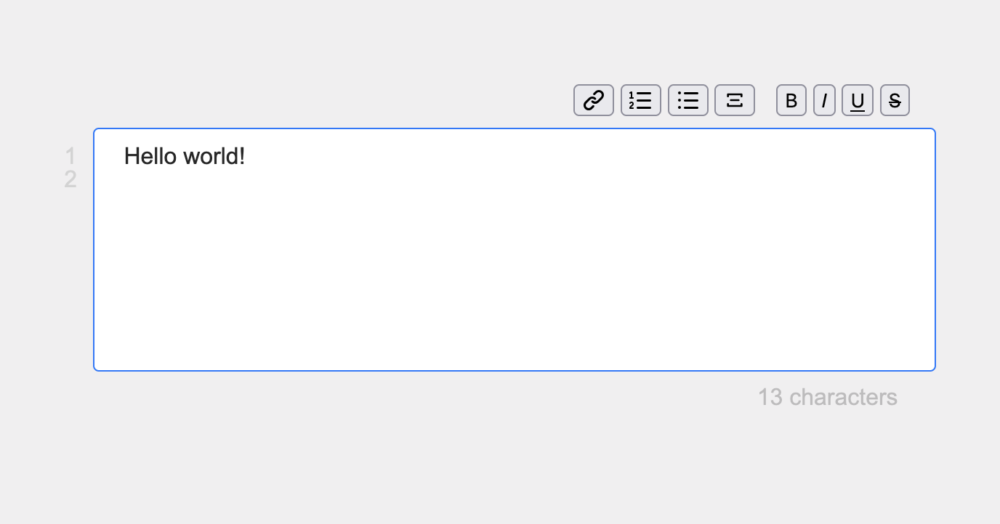

## Notepad tab

Basic notepad for your browser. 
Just open a new tab and paste the following url: https://emvaized.github.io/notepad-tab/#Hello

All text you input will be stored in the url of your tab, and restored on browser restart. It is local, and is not stored or sent anywhere else.

The first line of your note will also become the tab title. Changes are saved with a delay of 1 second, in order to not span browser history so much.

If anything happens to the server, you can always recover your note by copying part of the url after the `#` sign and open it in a new tab, prepending `data:text/html,` in the beginning. It's just plain html text. 

Features and ideas for improvement: 
- [x] Dynamic line numbers on the left
- [x] Support for rich text formatting
- [x] Characters count on the bottom
- [ ] Highlight current line
- [ ] Button to lock changes (toggles `contenteditable` on editor)
- [ ] Store more info in the url as json (last modified date, lock status, etc)
- [ ] Basic syntax highlight (or switch to a 3rd party embedded editor)
- [ ] Prepare minified `dist` directory with optimal performance

